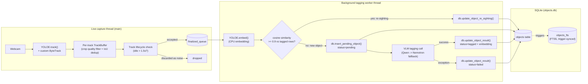
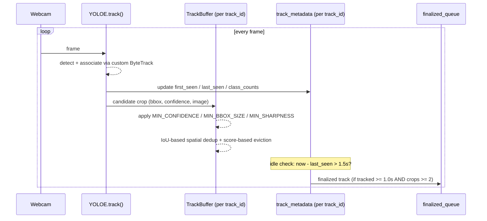
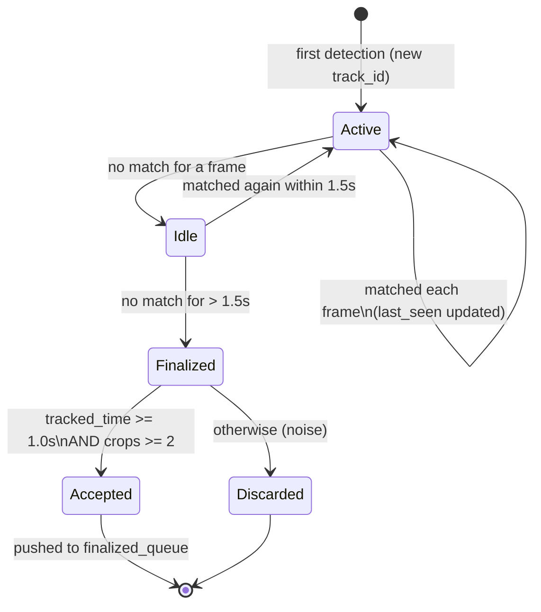
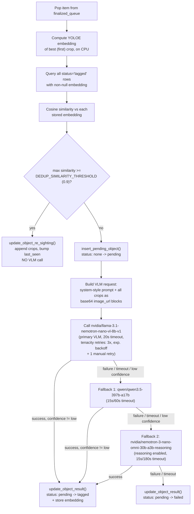
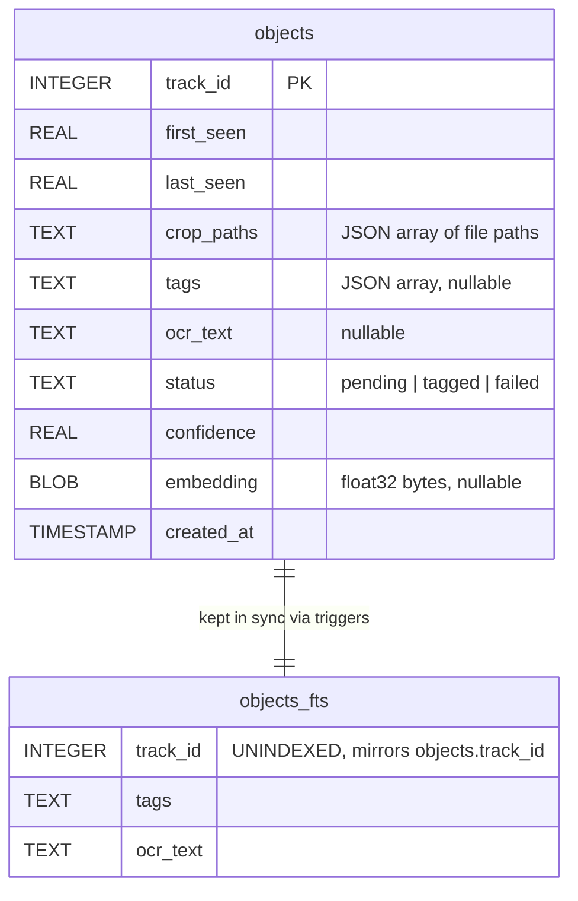

# Batman-Vision (backend)

A real-time webcam object detection and tracking prototype built on [Ultralytics YOLOE](https://github.com/ultralytics/ultralytics). It tracks objects across frames, buffers the best-quality crops per track, and hands off "finalized" tracks to a background worker that de-duplicates against previously seen objects (via YOLOE embeddings) and tags new ones using a vision-language model (VLM) for object name, descriptive tags, and OCR text. Results are persisted to SQLite with full-text search.

The pipeline exists in two forms sharing the same logic:

- **`main.py`** — a FastAPI server exposing the pipeline over HTTP (start/stop, MJPEG HUD stream, object/stats JSON), consumed by the `../frontend` Next.js dashboard. This is the intended way to run the system day-to-day.
- **`tests/yoloe_test.py`** — the original standalone script with a local OpenCV display window, useful for quick iteration without the frontend.

## Contents

- [System overview](#system-overview)
- [FastAPI server & HTTP API](#fastapi-server--http-api)
- [Live tracking loop](#live-tracking-loop)
- [Crop buffering & quality scoring](#crop-buffering--quality-scoring)
- [Track lifecycle](#track-lifecycle)
- [Background tagging worker](#background-tagging-worker)
- [Database schema](#database-schema)
- [Project layout](#project-layout)
- [Setup](#setup)
- [Running things](#running-things)

## System overview



Two threads make up the running system:

1. **Main thread** owns the webcam, runs detection/tracking every frame, buffers crops per track, and decides when a track's life is over.
2. **Worker thread** consumes finalized tracks off an in-memory `queue.Queue`, does embedding-based de-duplication, and calls out to a VLM to tag genuinely new objects. The two threads only communicate through `finalized_queue` and the shared SQLite database.

## FastAPI server & HTTP API

`main.py` runs the tagging worker thread continuously (started once at import time) and runs the capture/tracking loop (`capture_loop_func`) as an on-demand thread controlled via HTTP:

| Endpoint | Method | Description |
|---|---|---|
| `/pipeline/start` | POST | Starts the webcam capture + tracking thread. No-op if already running. |
| `/pipeline/stop` | POST | Stops the capture thread and releases the webcam. |
| `/pipeline/status` | GET | `{"active": bool}` — whether the capture thread is alive. |
| `/video_feed` | GET | MJPEG stream (`multipart/x-mixed-replace`) of the latest HUD-annotated frame; serves a static "Pipeline Stopped" placeholder when idle. |
| `/api/objects` | GET | All rows from the `objects` table, most recent (`last_seen`) first. |
| `/api/stats` | GET | Counts of `pending` / `tagged` / `failed` objects. |
| `/api/clear` | POST | Deletes all `objects` rows and crop files in `captures/`. Returns 400 if the pipeline is currently active. |
| `/captures/*` | GET | Static file mount serving crop JPEGs by relative path. |

CORS is restricted to `http://localhost:3000` / `http://127.0.0.1:3000` (the Next.js dev server) — update `CORSMiddleware` in `main.py` if the frontend origin changes. On server shutdown, the capture thread is signalled to stop and joined, then the tagging worker is stopped by pushing `None` onto `finalized_queue`.

Run it with:

```bash
uvicorn main:app --reload
```

## Live tracking loop

The core detection/tracking logic below is implemented twice: as `tests/yoloe_test.py::main()` (standalone, OpenCV window) and as `main.py::capture_loop_func()` (threaded, feeds the HTTP API instead of drawing a window). Both use the same thresholds, `TrackBuffer`, and lifecycle rules described in this section.



- Detection + tracking runs via `model.track(frame, tracker=custom_bytetrack.yaml, conf=0.1, device="mps")`. `device="mps"` is the intended happy path (Apple Silicon); it falls back to `"cpu"` only if MPS is unavailable.
- The custom tracker config (`tests/custom_bytetrack.yaml`) widens the tracking buffer (`track_buffer: 100` frames, vs. the ByteTrack default of 30) and uses dual confidence thresholds (`track_high_thresh` / `track_low_thresh`) so low-confidence detections can still extend an existing track without being used to start new ones.
- Each frame also draws a HUD overlay: per-box labels, a semi-transparent label background, and a rolling FPS counter (averaged over the last 30 frames).

## Crop buffering & quality scoring

Each active track ID owns a `TrackBuffer` (max 6 crops). A candidate crop is scored and admitted only if it clears three thresholds:

| Threshold | Constant | Purpose |
|---|---|---|
| Confidence | `MIN_CONFIDENCE = 0.35` | reject low-confidence detections |
| Bounding box area | `MIN_BBOX_SIZE = 1600` px | reject tiny/far-away boxes |
| Sharpness | `MIN_SHARPNESS = 50.0` | reject motion-blurred crops (Laplacian variance) |

Admitted crops are scored:

```
combined_score = confidence + (bbox_area / 10000) + (sharpness / 100)
```

```mermaid
flowchart TD
    A[New candidate crop] --> B{Passes MIN_CONFIDENCE,\nMIN_BBOX_SIZE, MIN_SHARPNESS?}
    B -->|no| Z[Discarded]
    B -->|yes| C[Compute combined_score]
    C --> D{IoU > 0.7 vs\nan existing buffered crop?}
    D -->|yes, and score is higher| E[Replace that crop]
    D -->|yes, but score is lower| Z
    D -->|no match| F{Buffer at capacity\n(6 crops)?}
    F -->|no| G[Append crop]
    F -->|yes, beats worst crop| H[Evict worst, insert new]
    F -->|yes, doesn't beat worst| Z
```

This keeps the buffer to a small set of spatially-distinct, high-quality views of the same object rather than 6 near-identical frames.

## Track lifecycle

A track is considered **finalized** once it hasn't been matched to a detection for more than 1.5 seconds (checked every frame, and force-run on any tracks still alive when the main loop exits).



## Background tagging worker

Implemented in `tests/yoloe_test.py::tagging_worker_func()`, consuming `finalized_queue`.



Notes:
- The VLM is expected to return strict JSON: `object_name`, `tags` (array), `ocr_text`, `confidence` (`high`/`medium`/`low`). Markdown code-fences around the JSON are stripped defensively before parsing.
- Three-level fallback chain: Llama-3.1-Nemotron-Nano-VL (primary) → Qwen → Nemotron Reasoning. Timeouts are kept short (15-20s on main.py) so one stuck call doesn't stall the worker thread for long. Tenacity retries (connection/timeout/rate-limit/server errors) plus one manual retry apply to the primary Llama-VL call and to the final Nemotron fallback when run in the offline test suite.
- All API calls go through NVIDIA's OpenAI-compatible endpoint (`https://integrate.api.nvidia.com/v1`), authenticated via `NVIDIA_API_KEY`.
- Status is always `None -> pending -> {tagged, failed}` — a track is never re-tagged once it lands in a terminal state (`tagged`/`failed`), except via the de-duplication path, which updates an existing `tagged` row directly.

## Database schema

Defined in `db.py::init_db()`.



`objects_fts` is an FTS5 virtual table that is never written to directly from Python — three SQL triggers keep it in sync with `objects`:

| Trigger | Fires on | Effect |
|---|---|---|
| `objects_after_insert` | `INSERT` on `objects` | inserts matching row into `objects_fts` |
| `objects_after_update` | `UPDATE OF tags, ocr_text` on `objects` | updates the FTS row's `tags`/`ocr_text` |
| `objects_after_delete` | `DELETE` on `objects` | removes the matching FTS row |

`db.search_objects(query_text)` runs an FTS5 `MATCH` query joined back to `objects`, and decodes the JSON-encoded `crop_paths`/`tags` columns before returning results.

`DB_PATH` and `CAPTURES_DIR` default to `objects.db` / `captures/` at the project root, but are overridable via the `BATMAN_DB_PATH` / `BATMAN_CAPTURES_DIR` environment variables — this is how the test suite isolates itself from real data.

## Project layout

```
.
├── main.py                    # FastAPI server: HTTP API + threaded pipeline (frontend talks to this)
├── recall.py                  # Standalone CLI: NL query -> keywords -> FTS5 search over tagged objects
├── db.py                      # SQLite persistence layer (schema, CRUD, FTS5 search)
├── download_models.py         # Stdlib-only script to fetch YOLOE weights
├── models/                    # Downloaded YOLOE checkpoints (gitignored)
├── embeddings/                # Cached YOLOE embeddings (gitignored)
├── captures/                  # Saved crop JPEGs (gitignored), served at /captures by main.py
├── objects.db                 # Runtime SQLite database (gitignored)
├── .env                       # NVIDIA_API_KEY (gitignored)
└── tests/
    ├── yoloe_test.py           # Standalone live application: tracking loop + tagging worker, OpenCV window
    ├── custom_bytetrack.yaml   # Tuned ByteTrack tracker config
    ├── smoke_test.py           # Webcam + MPS availability check
    ├── seed_recall_db.py       # Seeds an isolated test DB with fake tagged objects, for exercising recall.py
    ├── test_db.py              # Unit tests for db.py
    └── test_tagging_worker.py  # End-to-end manual test of the tagging worker (live API calls)
```

## Setup

```bash
python3 -m venv .venv
source .venv/bin/activate
# install dependencies as needed (no requirements.txt is checked in yet):
# ultralytics, opencv-python, torch/torchvision, openai, tenacity, python-dotenv, numpy, fastapi, uvicorn

python download_models.py   # fetches yoloe-{11s,26s,26l}-seg-pf.pt into models/
```

Create a `.env` file at the project root:

```
NVIDIA_API_KEY=your-key-here
```

## Running things

| Command | What it does |
|---|---|
| `uvicorn main:app --reload` | Starts the FastAPI server (HTTP API, MJPEG stream, threaded pipeline). This is what `../frontend` talks to; see [FastAPI server & HTTP API](#fastapi-server--http-api). |
| `python tests/smoke_test.py` | Verifies MPS availability and webcam access. Interactive, quit with `q`. |
| `python tests/yoloe_test.py` | Runs the standalone live application: tracking + HUD overlay + background tagging worker, in an OpenCV window. Interactive, quit with `q`. |
| `python recall.py "<query>"` | Extracts search keywords from a natural-language query via NVIDIA API and searches tagged objects (FTS5). Requires `NVIDIA_API_KEY`. |
| `python tests/test_db.py` | Unit tests for `db.py` against an isolated test database. |
| `python tests/test_tagging_worker.py` | End-to-end test of the tagging worker against synthetic crops, including a live NVIDIA API call and a simulated network-failure case. **Makes real API calls** — requires `NVIDIA_API_KEY` and a downloaded model. |
| `python tests/seed_recall_db.py` | Seeds an isolated test database with fake tagged objects, useful for trying `recall.py` without running the live pipeline. |
